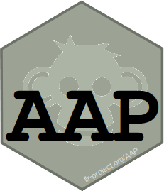

# AAP 

## Overview

Aarts and Poos Stock Assessment Model that Estimates Bycatch

To install this package, start R and enter:

	install.packages("AAP", repos="http:///flr-project.org/R")

## Documentation
- [Help pages](http://flr-project.org/AAP)

## Build Status

## Releases
- [Latest release](https://github.com/flr/R/releases/latest)
- [All releases](https://github.com/flr/R/releases/)

## License
Copyright (c) 2020-2022 WUR. Released under the EUPL 1.2.

## Contact
You are welcome to:

- Submit suggestions and bug-reports at: <https://github.com/flr/AAP/issues>
- Send a pull request on: <https://github.com/flr/AAP/>
- Author: Iago Mosqueira (WMR), based on a model by Jan Jaap Poos & Geert Aarts.
- Maintainer: Iago Mosqueira <iago.mosqueira@wur.nl>
